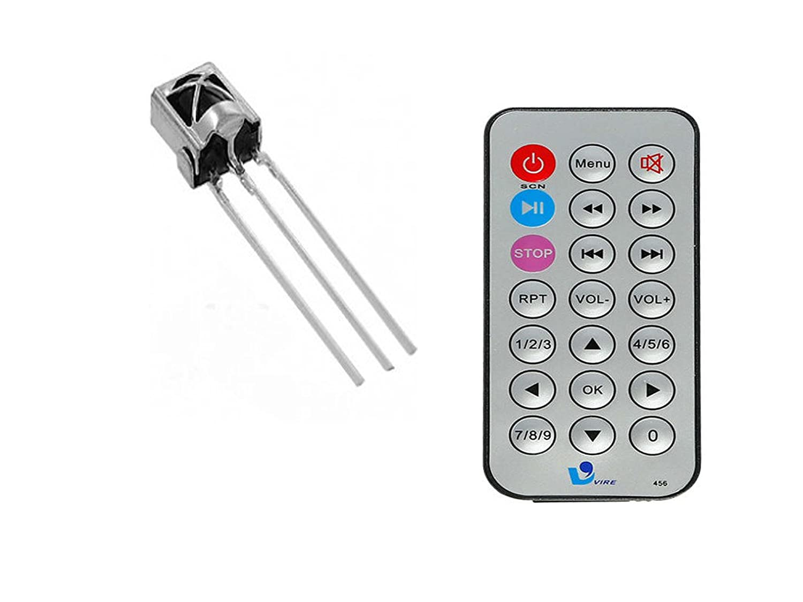

# Sensor IR Receiver

El sensor IR Receiver: Este módulo consta de un receptor IR 1838, una resistencia de 1kΩ y un LED. Funciona junto con el módulo transmisor IR KY-005 . Compatible con plataformas electrónicas populares como Arduino. Sirve muy bien para controles remoto universales, marco de fotos digital, iluminación equipada y otras aplicaciones.

| Características                       |                                          |                                       |  
|---------------------------------------|------------------------------------------|---------------------------------------|
| Dimensión: 6.4 x 7.4 x 51 mm          | Frecuencia: 37.9KHz                      | Ángulo de recepción: 90° (± 45°)      |   
| Ángulo de recepción: 90 °             | Alcance de recepción: 18m                | Filtro de luz ambiental: hasta 500LUX |   
| Voltaje de funcionamiento: 2.7 ~ 5.5V | Corriente de funcionamiento: 0.4 a 1.5mA |                                       |    

# Sensor IR Remote:
Un control remoto infrarrojo (IR) envía señales de luz infrarroja. Una luz infrarroja no puede verse a simple vista, pero puede ser visible con el uso de una cámara digital, la cámara del teléfono celular o videocámara.

Caracteristicas 
- Modulación a 38kHz
- 21 teclas de función para el control remoto
- Angulo de Operación: 60º
- Temperatura: -25 a 85ºC
- Distancia de Operación: 8-10 mts
- Compatible con la librería IR de Arduino

Uso
Los sensores infrarrojos ofrecen una solución para ciertos procedimientos de reconocimiento, por ejemplo, los de mama y de músculos. Otra aplicación médica para los sensores infrarrojos es la medición instantánea de la temperatura del cuerpo, es decir, como un termómetro remoto o infrarrojo.

